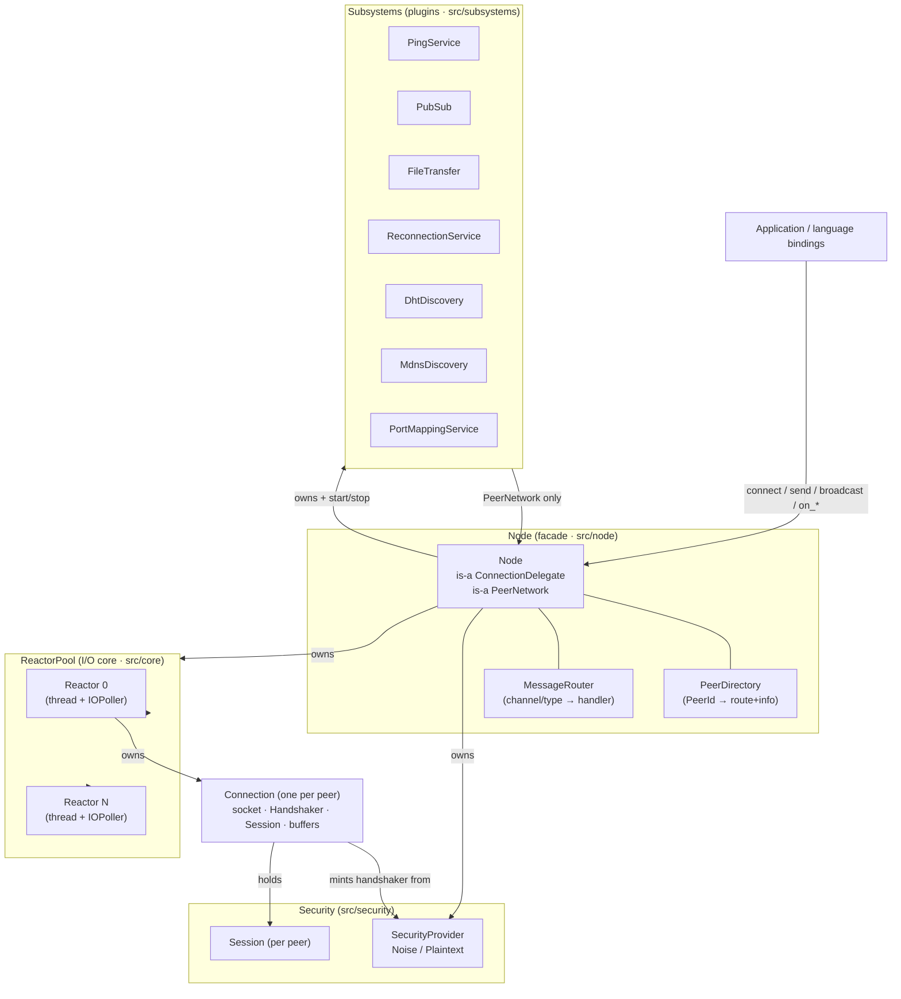
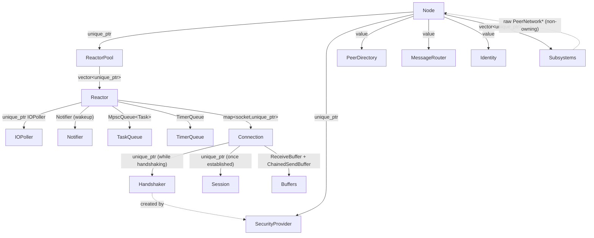
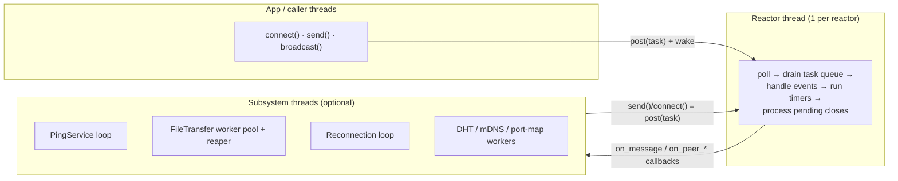
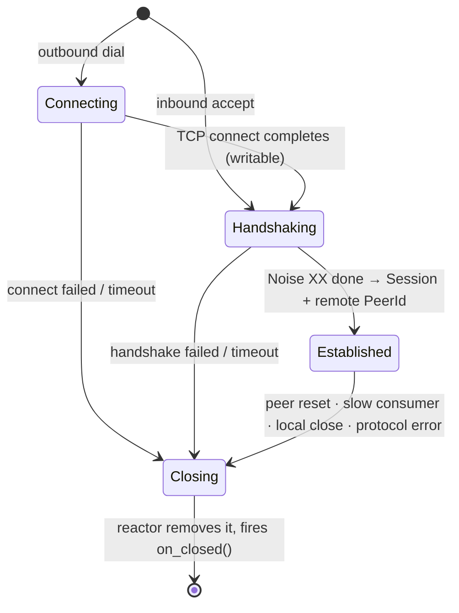
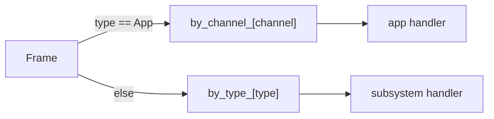
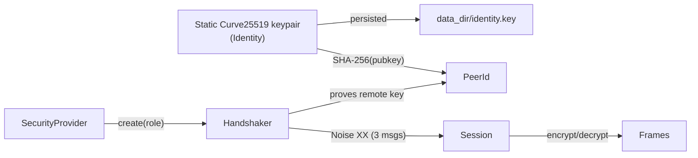
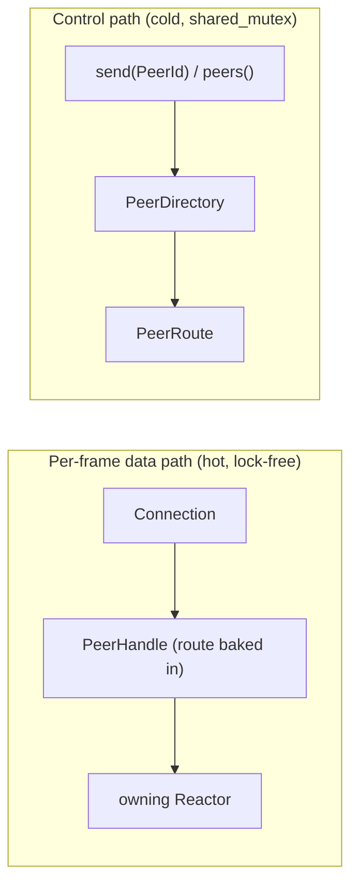
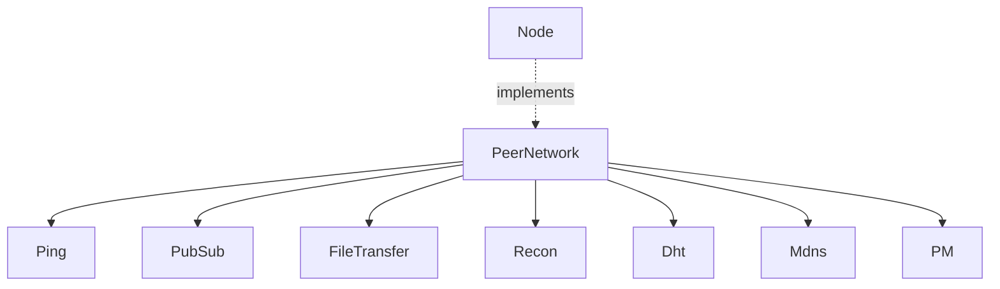

# librats — Architecture

> This document describes the **current** architecture of librats after the core
> rewrite (the modular reactor/subsystem design). It is written for three readers:
> a **user** who just wants to know what the library does and how to drive it, a
> **developer** integrating or extending it, and a **maintainer** who needs to know
> exactly which class owns what, on which thread, and who is allowed to touch it.
>
> Diagrams are [Mermaid](https://mermaid.js.org) (rendered by GitHub) plus ASCII
> for wire formats. Read top‑to‑bottom: each section zooms in one level.

---

## 1. What librats is, in one paragraph

librats is a C++17 peer‑to‑peer networking library. A **`Node`** listens on a TCP
port, dials other nodes, performs an authenticated **Noise XX** handshake, and then
exchanges length‑framed, encrypted messages. Everything above the raw connection —
peer discovery (DHT, mDNS), NAT traversal (UPnP/NAT‑PMP, STUN/TURN/ICE), pub/sub,
file transfer, liveness — is a **pluggable subsystem** that talks to the network
through one small interface and never sees the Node's internals. The design is
**shared‑nothing**: every connection lives on exactly one I/O thread that owns it
outright, so the hot path holds **no locks**.

---

## 2. The big picture



**One sentence per layer:**

| Layer | Directory | Responsibility |
|------|-----------|----------------|
| **Bindings** | `src/bindings` | Thin C ABI (`rats_node_*`) over `Node`, the base for other languages. |
| **Node (facade)** | `src/node` | Wires the layers together; the public C++ entry point. Owns everything below. |
| **Subsystems** | `src/subsystems` | Optional features as plugins; reach the mesh only via `PeerNetwork`. |
| **Net** | `src/net` | Wire framing, `PeerId`, `PeerDirectory`, `MessageRouter`, addresses. |
| **Security** | `src/security` | Handshake + per‑peer encryption (`Identity`, `Handshaker`, `Session`). |
| **Core** | `src/core` | The reactor, connections, timers, buffers — the lock‑free I/O engine. |
| **Crypto** | `src/crypto` | Self‑contained primitives: Noise, Curve25519, ChaCha20‑Poly1305, SHA, CRC32. |
| **Engines** | `src/dht` `src/mdns` `src/nat` `src/bittorrent` | Standalone protocol implementations the subsystems wrap. |
| **Util** | `src/util` | `fs`, `os`, `logger`, `network_utils`, `json`, `version`. |

---

## 3. Source layout (where things live)

```
src/
├── main.cpp                  # example chat node (the only file left at root)
├── bindings/   rats_node.{h,cpp}            — C ABI
├── node/       node, message_router, config, peer (PeerHandle), peer_network
├── net/        frame, peer_id, peer_info, peer_directory, peer_store, address
├── security/   identity, handshaker (+ SecurityProvider), session,
│               noise_security, plaintext_security
├── core/       reactor, reactor_pool, connection, timer_queue, mpsc_queue,
│               notifier, bytes, types, socket, io_poller,
│               receive_buffer, chained_send_buffer, wakeup_pipe, threadmanager
├── crypto/     noise, curve25519, chacha20poly1305, sha256/512, blake2, hkdf,
│               sha1, crc32
├── subsystems/ ping_service, pubsub, file_transfer, reconnection,
│               dht_discovery, mdns_discovery, port_mapping_service
├── dht/        dht (Kademlia/Mainline), krpc, bencode
├── mdns/       mdns
├── nat/        stun, turn, ice, upnp, natpmp, port_mapping
├── bittorrent/ bittorrent, bt_*, disk_io, tracker   (optional: RATS_SEARCH_FEATURES)
├── storage/    storage                               (optional: RATS_STORAGE)
└── util/       fs, os, logger, network_utils, network_monitor, json, version,
                rats_export
```

**The cardinal rule of the rewrite:** dependencies point **downward**. A subsystem
depends on `PeerNetwork` (an interface), never on `Node`. `Node` depends on the
reactor/security/net layers. The reactor depends on nothing above it. There are no
`friend` declarations crossing layers and no god‑class — the contrast with the old
monolithic `RatsClient` (≈4,700 lines, ~250 methods, one giant `peers_mutex_`) is
the whole point.

---

## 4. Ownership — who holds what

This is the single most useful map for a maintainer: follow the arrows to know what
keeps an object alive and who is allowed to free it.



Key points:

- **`Node` owns everything.** Destroying the `Node` calls `stop()`, which stops
  subsystems first, then the reactors (joining their threads). Member destruction
  order then tears the rest down safely.
- **A `Reactor` owns its `Connection`s** in an `unordered_map<socket_t, unique_ptr<Connection>>`.
  No one else holds a `Connection`. It is destroyed on the reactor thread during
  teardown.
- **A `Connection` owns its `Session`** (post‑handshake) and, transiently, its
  `Handshaker`. The `Session` is what actually encrypts/decrypts bytes.
- **Subsystems hold a non‑owning `PeerNetwork*`** (which happens to be the `Node`).
  They never extend its lifetime and never see its concrete type.
- **`PeerHandle` is a value**, not an owner: `{PeerId, PeerRoute, Node*}`. It is
  handed to callbacks so the reply path can reach the right reactor with no lookup.

---

## 5. Threading model



- **Reactor thread(s)** — the heart. Each runs a single loop: wait on the
  `IOPoller`, drain the cross‑thread **task queue**, dispatch socket events, fire
  due timers, then process deferred connection closes. **All `Connection` state is
  touched only here**, which is why connections need no locks or atomics.
- **App threads** never touch a `Connection` directly. `connect/send/broadcast`
  package the work into a closure and `post()` it to the owning reactor, waking it
  via a `Notifier` (a self‑pipe / loopback socket).
- **Subsystem threads** are owned by individual subsystems that need timers or
  blocking work (PingService, ReconnectionService, FileTransfer's worker pool, the
  DHT/mDNS/port‑mapping engines). They reach the network the same way app threads
  do — through `PeerNetwork`, which posts to a reactor.
- **Callbacks** (`on_peer_connected`, `on_message`, …) run **on a reactor thread**.
  Register them before `start()`; do not block in them.

### Concurrency rules (the short version)

| Structure | Guard | Notes |
|-----------|-------|------|
| `Connection`, recv/send buffers, handshake state | **none** | single reactor thread only |
| Cross‑thread work into a reactor | `MpscQueue<Task>` + `Notifier` | the one synchronization point on the data path |
| `PeerDirectory` | `shared_mutex` | off the per‑byte path; short critical sections |
| Each subsystem's own state | that subsystem's own mutex | independent, fine‑grained |

There is no global `peers_mutex_`. Lock contention that dominated the old design is
structurally gone.

---

## 6. A connection's life



Outbound and inbound sequences:

```mermaid
sequenceDiagram
    participant App
    participant Node
    participant Reactor
    participant Conn as Connection
    participant Peer

    App->>Node: connect(host, port)
    Node->>Reactor: pick().connect()  (posts task)
    Reactor->>Conn: adopt(socket, Outbound) + 15s establish timer
    Conn->>Peer: TCP SYN (non-blocking)
    Peer-->>Conn: writable → connect ok
    Conn->>Peer: Noise msg 1
    Peer-->>Conn: Noise msg 2
    Conn->>Peer: Noise msg 3  (handshake done)
    Conn->>Node: on_established(conn)  [reactor thread]
    Node->>Node: directory.add(PeerInfo, route); fire on_peer_connected
    loop application traffic
        Conn->>Peer: encrypted framed messages
        Peer-->>Conn: encrypted framed messages → on_frame → MessageRouter
    end
    Peer-->>Conn: FIN / reset
    Conn->>Reactor: fail(reason)
    Reactor->>Node: on_closed(conn, reason); directory.remove; fire on_peer_disconnected
```

A subtle but important rule: a close is **deferred**. When something decides to tear
a connection down, the reactor records it in `pending_close_` and only removes it
**after** the current event dispatch finishes. That is what makes it safe for a
callback to close connections (even this one) without invalidating iterators or
freeing an object that is still on the stack.

---

## 7. The wire — two‑level framing

Bytes on the socket are a stream of **outer blocks**. Each block body is opaque to
the framing layer: during the handshake it is a raw Noise message; once established
it is the **encrypted** form of an **inner message**.

```
Outer block (src/net/frame.*)            Inner message (decrypted body)
┌────────────┬───────────────┐           ┌──────┬───────┬─────────┬───────────┐
│ length u32 │     body      │           │ type │ flags │ channel │  payload  │
│  4 bytes   │  length bytes │           │  u8  │  u8   │   u16   │    ...    │
└────────────┴───────────────┘           └──────┴───────┴─────────┴───────────┘
length capped at 64 MiB (kMaxBlockSize)   type = MessageType; channel only for App
```

Sending a frame: `encode_message` → `Session::encrypt` → `encode_block` →
appended to the connection's `ChainedSendBuffer` → flushed to the socket
(write‑through, falling back to a `PollOut` arm when the kernel buffer is full).

Receiving: `recv` into a `ReceiveBuffer` ring → `try_take_block` peels complete
blocks → `Session::decrypt` → `parse_message` → delivered. Decoding is zero‑copy:
views point into the receive buffer and are valid only until consumed.

`MessageType` values:

| Value | Name | Used by |
|------:|------|---------|
| 1 | `App` | application channels (addressed by 16‑bit `channel`) |
| 2 | `Control` | core control plane (peer exchange, …) |
| 3 | `Gossip` | `PubSub` |
| 4 | `FileChunk` | `FileTransfer` |
| 5 | `Ping` | `PingService` |

---

## 8. Routing inbound messages

`MessageRouter` turns a decoded `Frame` into a handler call. Two namespaces:

- **Application channels** — `MessageType::App` frames are dispatched by a 16‑bit
  channel id, which is an FNV‑1a hash of a channel **name** (`"chat"`, `"orders"`,
  …). `node.on_message("chat", cb)`.
- **Message types** — non‑App frames dispatch by `MessageType`. This is how
  subsystems register: `network.on_message(MessageType::Gossip, cb)`.



---

## 9. Identity & security



- **`PeerId`** is `SHA‑256(static public key)` — *self‑certifying*. Because the
  Noise XX handshake proves possession of that key, a completed handshake also
  proves the peer's id; it cannot be forged (same scheme as libp2p). 32 bytes,
  value type, hashable — a map key.
- **`Identity`** = the node's static keypair + its `PeerId`. Ephemeral by default;
  with `data_dir` set it loads/saves `identity.key` for a **stable id across
  restarts**.
- **`SecurityProvider`** is node‑wide policy: `NoiseSecurity` (encrypted, default)
  or `PlaintextSecurity` (no encryption, same code path via a passthrough
  `Session`). It mints one `Handshaker` per connection.
- **`Handshaker`** drives the handshake (`start` → `consume`…) until it yields a
  `Session` and the remote `PeerId`, or fails. **`Session`** then encrypts every
  outbound frame and decrypts every inbound one. Swapping the provider changes the
  whole node's security posture without touching any transport code.

The Noise protocol is `Noise_XX_25519_ChaChaPoly_SHA256`; all primitives are
self‑contained in `src/crypto` (no external crypto dependency).

---

## 10. The control plane: PeerDirectory, PeerRoute, PeerHandle

These three carry identity/routing **off** the data path:

- **`PeerRoute` `{reactor index, ConnId}`** — exactly where a peer's live
  connection is. `ConnId` is stable for the connection's life and never reused.
- **`PeerDirectory`** — `PeerId → {PeerInfo, PeerRoute}`, guarded by a
  `shared_mutex`. Written on connect/disconnect, read on by‑id lookups
  (`send(peerId,…)`, `peers()`). Never touched per frame.
- **`PeerHandle`** — the value passed to callbacks. It already knows the route, so
  `peer.send(...)` / `peer.disconnect()` reach the owning reactor **without** a
  directory lookup. `peer.info()` consults the directory on demand.



---

## 11. Subsystems — the plugin model

Every optional feature implements **`Subsystem`** and talks to the world only
through **`PeerNetwork`**. That is the entire contract:

```cpp
class Subsystem {
    virtual void attach(PeerNetwork&) = 0;  // register handlers (before start)
    virtual void start() = 0;               // spin up own threads, if any
    virtual void stop()  = 0;               // join threads, release resources
};

class PeerNetwork {                         // what a subsystem is allowed to do
    const PeerId& local_id() const;
    uint16_t      listen_port() const;
    void          connect(const Address&);
    void          send(const PeerId&, MessageType, ByteView);
    void          broadcast(MessageType, ByteView);
    std::vector<PeerId> connected_peers() const;
    void on_message(MessageType, MessageHandler);
    void on_peer_connected(PeerEventHandler);
    void on_peer_disconnected(PeerDisconnectHandler);
};
```

Because it depends on an interface, a subsystem is trivially unit‑tested against a
fake `PeerNetwork`.



The current subsystems:

| Subsystem | What it does | Own thread(s)? | Wire (`MessageType`) | Wraps engine |
|-----------|--------------|----------------|----------------------|--------------|
| **PingService** | Liveness + RTT; pings every peer, echoes pongs | yes (ping loop) | `Ping` | — |
| **PubSub** | Subscription‑aware floodsub: publish to interested peers, dedup loops | no (event‑driven) | `Gossip` | — |
| **FileTransfer** | Push a file/directory tree; CRC32 per chunk + SHA‑256 per file; sliding‑window backpressure; pause/resume/cancel; idle timeout | yes (worker pool + reaper) | `FileChunk` | — |
| **ReconnectionService** | Keep a set of addresses connected with exponential backoff; optional persistence | yes (dial loop) | — | `PeerStore` |
| **DhtDiscovery** | Announce/find peers under a discovery hash on the Kademlia DHT | yes (search loop) | — | `src/dht` |
| **MdnsDiscovery** | Announce + browse the LAN; dial discovered instances | via engine | — | `src/mdns` |
| **PortMappingService** | Forward the listen port through the router (UPnP + NAT‑PMP); detects double‑NAT | via engines | — | `src/nat` |

Subsystems are attached **before** `start()` so the router is fully built before any
reactor thread runs (no concurrent writes to the handler registry):

```cpp
Node node(config);
node.add_subsystem(std::make_unique<DhtDiscovery>(DhtDiscovery::Config{}));
node.add_subsystem(std::make_unique<PingService>());
node.on_message("chat", [](const PeerHandle& p, ByteView data){ /* ... */ });
node.start();
```

---

## 12. Engines (wrapped, not rewritten)

The discovery / NAT / BitTorrent code are standalone, well‑tested implementations.
The rewrite **wraps** them as subsystems rather than touching them, so all the
protocol logic stays where it was:

- **`src/dht`** — Kademlia DHT compatible with BitTorrent Mainline (`DhtClient`,
  `krpc`, `bencode`). `DhtDiscovery` drives it.
- **`src/mdns`** — `MdnsClient` for LAN discovery. `MdnsDiscovery` drives it.
- **`src/nat`** — `stun`/`turn`/`ice` (NAT traversal) and `upnp`/`natpmp` (port
  mapping). `PortMappingService` drives the latter.
- **`src/bittorrent`** — full BT client (peer wire protocol, piece picker, disk
  I/O, trackers, torrent creation, BEP‑9 metadata). Optional
  (`-DRATS_SEARCH_FEATURES=ON`).

---

## 13. Persistence

| File | Written by | Contents |
|------|-----------|----------|
| `data_dir/identity.key` | `Node` (via `Identity`) | 32‑byte static private key → stable `PeerId` |
| reconnection store | `PeerStore` (used by `ReconnectionService`) | addresses to keep re‑dialing across restarts |

With an empty `data_dir`, the node is fully ephemeral: a fresh identity every run.

---

## 14. Bindings

`src/bindings/rats_node.{h,cpp}` is a **C ABI** (`extern "C"`, opaque
`rats_node_t`) over `Node`: create/start/stop, `connect`, `send`/`broadcast`,
the three callbacks (peer up / peer down / message), and `enable_dht` /
`enable_mdns` / `enable_port_mapping`. It is the foundation other language
bindings build on.

---

## 15. Build matrix

| Option | Default | Effect |
|--------|---------|--------|
| `RATS_BUILD_TESTS` | OFF | builds `librats_tests` (GoogleTest) |
| `RATS_SEARCH_FEATURES` | OFF | compiles the BitTorrent client (`src/bittorrent`) |
| `RATS_STORAGE` | OFF | compiles distributed storage (`src/storage`) |
| `RATS_SHARED_LIBRARY` | OFF | build a shared lib (disables tests) |
| `RATS_ENABLE_ASAN` | OFF | AddressSanitizer (Linux/macOS) |

Include roots are `src/`, `src/crypto/`, and the generated `${build}/src/`, so a
header in a subdirectory is included as `"subdir/header.h"` (e.g.
`"core/connection.h"`), while `crypto/` headers may also be included bare.

---

## 16. Quick reference — "who holds / uses what"

| If you have… | …you can reach | …because |
|--------------|----------------|----------|
| a `Node` | reactors, subsystems, directory, security | it owns them all |
| a `PeerHandle` (in a callback) | that peer's reactor directly | the route is baked in |
| a `PeerId` | a `PeerRoute` (if connected) | via `PeerDirectory::route()` |
| a `Connection` | its `Session`, buffers, `remote_id` | it owns them; reactor‑thread only |
| a `Subsystem` | `connect/send/broadcast/on_*` | through its `PeerNetwork*` |
| a reactor thread | every `Connection` it owns | single‑threaded, no locks |

**The mental model:** `Node` composes the layers and is the `ConnectionDelegate`
the reactors report to. Reactors own connections and run the lock‑free I/O loop.
Connections own the secure session and the framing. Subsystems are guests that only
ever speak `PeerNetwork`. Identity is a hash of a key, so trust travels with the
handshake. Keep that picture and the rest of the code reads itself.
